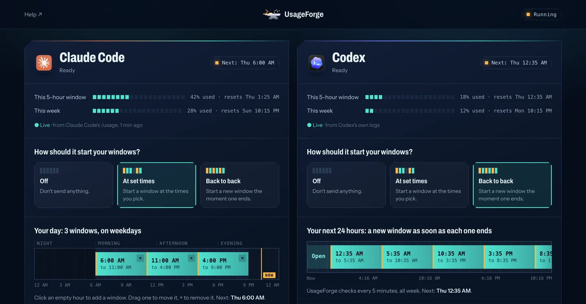

# UsageForge

**Your AI usage window, on your schedule.** An [Aurora Forge Lab](https://auroraforgelab.com/) product.

On the $20 Claude Pro / ChatGPT Plus plans, the 5-hour usage window starts with your first message.
UsageForge sends that first message for you, so a fresh window is already running when you sit down to work.

One bash script. No daemon, no stored credentials. It needs `bash` and `jq`; macOS 15+ ships `jq`, otherwise run `brew install jq` or `apt install jq`.
It uses `launchd` on macOS and `cron` on Linux. Windows isn't supported. WSL may work through cron, but it hasn't been tested.

**Product page:** https://kenny2077.github.io/UsageForge/



## Install

```bash
brew install kenny2077/tap/usageforge
usageforge ui        # pick your times in the control panel
usageforge doctor    # checks your setup and tells you what to fix
```

Without Homebrew:

```bash
git clone https://github.com/kenny2077/UsageForge && cd UsageForge
ln -s "$PWD/usageforge" ~/.local/bin/usageforge   # any directory on your PATH
```

You need `claude` (Claude Code) and/or `codex` installed and logged in. If the ChatGPT desktop app is installed, UsageForge uses the Codex CLI bundled inside it. Otherwise install it with `npm i -g @openai/codex`.
UsageForge pings whichever of the two it finds.

## Control panel

```bash
usageforge ui        # opens http://127.0.0.1:4517 in your browser (needs python3)
```

The terminal shows a small pixel dawn and the same setup check as `usageforge doctor`. The first time the panel opens, a short guide points out each part; **Guide** in the header replays it.

The panel has one section each for Claude Code and Codex. In each you can:
- pick a mode: **Off**, **At set times** or **Back to back**
- add ping times and choose the weekdays they run on, with a 24-hour preview of the windows they open
- set the message and model
- send a message now and see the reply as a chat

Each section also shows the 5-hour and weekly meters. Changes save automatically, and the background check turns itself on or off to match.
The panel only listens on 127.0.0.1, and every request must carry a random token that's created each time the panel starts.

## Notifications

UsageForge sends a notification when something goes wrong (offline, signed out, or a usage limit reached). It also notifies you when this week's usage passes 90%. Each kind of problem notifies you at most once every 6 hours.
A notification each time a window starts is off by default. Turn the types on or off under **Notify me** in the control panel.

## Modes from the terminal

`schedule` and `watch` set the mode for every installed tool (or only `UF_TOOLS="claude"`) and turn on the background check.

**1. Schedule: ping at fixed times you choose.**
```bash
usageforge schedule 06:00            # window runs 6–11, so your 9am session gets a reset at 11
usageforge schedule 06:00 11:00 16:00
```

**2. Watch: start the next window as soon as the last one resets.**
```bash
usageforge watch     # checks every 5 min; it only sends a message after a window ends
```

```bash
usageforge ping            # ping now (or: usageforge ping codex)
usageforge status          # each tool's mode and reset time, and the recent log (--json for scripts)
usageforge start | stop    # turn the background check on / off (settings stay in ~/.local/state/usageforge)
```

Settings live in `~/.local/state/usageforge/config.json`. For each tool it stores `mode`, `times`, `days` (0 = Sunday), `prompt` and `model`.
There's one background check, run every 5 minutes. It re-reads the settings each time, so changes take effect without reinstalling.
`start` copies the script into the state directory and runs it from there. macOS doesn't let launchd jobs read `~/Desktop` or `~/Documents`, and the copy also keeps working if you move or delete the repo.

## How it works

- **Ping.** The message is a plain greeting for the time of day ("Good morning", "Good afternoon" or "Good evening").
  Claude: `claude -p "Good morning" --model haiku --tools "" --safe-mode`, run from an empty directory with user settings off.
  That means no hooks, plugins, MCP or CLAUDE.md get loaded, so the ping uses very little quota.
  Codex: `codex exec --sandbox read-only --ignore-user-config -c model_reasoning_effort=low "Good morning"`.
  `--ignore-user-config` skips your MCP servers; it's added only on Codex versions that support it.
- **Reset detection (watch mode). It spends no quota and reads no tokens.**
  - Codex writes its own limits to `~/.codex/sessions/**/rollout-*.jsonl` (`payload.rate_limits.primary.resets_at`).
    UsageForge reads them there, so it also sees windows that you started yourself.
  - Claude: UsageForge runs Claude Code's own `/usage` command (`claude -p /usage`). It runs locally, sends no message and costs no quota.
    That gives the live 5-hour and weekly percentages and the exact reset times. The control panel refreshes it at most once a minute, and the background check once every 5 minutes.
- **When a ping fails:**
  - **Rate-limited** (5-hour or weekly cap): UsageForge waits until the reset time the server reports. For Codex it reads the weekly figure from the logs, so it doesn't send pings that can't succeed.
  - **Anything else** (still offline after a wake-up, logged out): it retries 3 times, one minute apart, then backs off for 15 minutes.
  - **Hung ping:** each one is killed after 2 minutes.
- Job pings wait a random 0–2 minutes (`UF_JITTER`, in seconds) so they don't land on the same second every day.
- Only one job run happens at a time, enforced with a lock. The log is trimmed to its last 1000 lines once it passes 2000.
- Logs go to `~/.local/state/usageforge/log`, which only your user can read.

## Caveats

- **A sleeping laptop can't send anything.** launchd runs a missed job as soon as the Mac wakes.
  To wake the Mac for a 6:00 ping: `sudo pmset repeat wakeorpoweron MTWRFSU 05:58:00`.
  Linux cron skips jobs missed during sleep. Watch mode catches up on its next 5-minute check.
  cron uses the system time zone, which is often UTC on servers.
- **`claude -p` billing may change.** If Anthropic starts billing it separately (announced, then paused, in 2026), a `claude -p` ping might stop opening the interactive window. See `docs/research.md`.
- Each ping uses a small amount of your weekly (7-day) quota. Watch mode sends about 4–5 pings a day.
- This moves *when* your window starts. It doesn't give you more usage.

## Uninstall

```bash
usageforge stop && rm -rf ~/.local/state/usageforge
```

## Test

`./test.sh` uses fake `claude`/`codex` binaries. It spends no quota and installs nothing.
It covers watch-mode ticks, rejected pings, retry and backoff, the Codex weekly cap, and escaping in the generated plist.

## Prior art

[CCAutoRenew](https://github.com/aniketkarne/CCAutoRenew), [cwarm](https://pypi.org/project/cwarm/) and [claude-warmup](https://github.com/vdsmon/claude-warmup) are all Claude-only. `docs/research.md` compares them.

## Upgrading from LimitKiller

The project was renamed. Run `limitkiller stop` first, then install `usageforge` and pick a mode again.

## License

MIT. Not affiliated with Anthropic or OpenAI.
